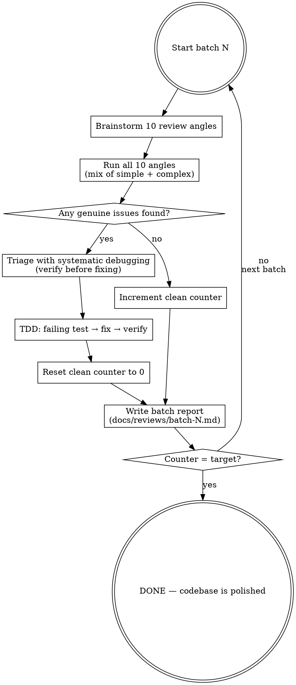

# Mirror Polish Protocol

## Overview

An iterative code review protocol that runs batch after batch of review rounds until the codebase resists scrutiny across N consecutive clean batches. Each batch invents fresh review angles using **brainstorming**, verifies findings using **systematic debugging**, fixes issues using **TDD**, and writes a review report. The exit condition — consecutive clean batches with zero fixes — ensures genuine completeness rather than reviewer fatigue.

**Core principle:** A codebase is "polished" not when you stop finding bugs, but when you can't find bugs across multiple independent attempts.

## When to Use

- Production-hardening a codebase before launch
- After major refactoring — verify nothing was broken
- When single-pass code review keeps missing issues
- Compliance or security review requiring exhaustive coverage
- "Find all the bugs" requests
- When the cost of a missed bug is high

## When NOT to Use

- Quick feature work (overkill)
- Prototype/throwaway code
- When time budget doesn't allow iteration

## Validation Modes

Before starting, ask the user which validation mode to use:

### Mode 1: Code-Only Verification (Recommended First)

Structural and static analysis — no deployments, no live services. Tests use grep patterns, AST checks, config parsing, and unit tests to verify code correctness.

**Use when:** Hardening code before any deployment. Fast iteration — a full batch takes minutes, not hours.

**How fixes are verified:** Write a failing structural test (e.g., grep for the bad pattern), fix the code, confirm the test passes. No deploy needed.

**Always do this mode first.** A codebase that fails structural review will be disastrous in live validation — every deploy-wait cycle wasted on bugs that grep could have caught.

### Mode 2: Live System Validation

Deploy to a real environment and run E2E tests against the live service. Catches runtime issues that static analysis cannot: container startup failures, network timeouts, auth flows, API integration bugs.

**Use when:** Code-only verification is complete (0 structural issues remain) and you need to validate runtime behavior.

**The deploy-wait bottleneck:** In live mode, each deploy cycle has a fixed cost (build + deploy + health check wait). If you fix one bug, deploy, wait, test, fix another, deploy, wait, test — 10 bugs = 10 deploy cycles. Instead:

```
❌ Slow: fix → deploy → wait → test → fix → deploy → wait → test  (10x wait)
✅ Fast: find all 10 → fix all 10 → deploy once → wait once → test all  (1x wait)
```

**This is why the batch-of-10 design matters.** Each batch reviews 10 angles, collects ALL fixes, applies them together, then deploys ONCE. The batch structure eliminates the deploy-wait bottleneck.

**Live mode flow per batch:**
1. Brainstorm 10 review angles (same as code-only)
2. Run all 10 angles against the live system
3. Collect ALL issues found across the batch
4. Fix ALL issues locally with TDD
5. Deploy once (single build + deploy cycle)
6. Wait for service to be healthy
7. Re-run E2E tests to verify all fixes
8. Write batch report, update counter, continue

### Mode Selection Guide

| Situation | Mode | Why |
|-----------|------|-----|
| First time running protocol | Code-only | Catch structural bugs fast, no deploy overhead |
| Code-only achieved 5 clean batches | Live | Validate runtime behavior |
| Post-refactor, no deploy changes | Code-only | Structure changed, not runtime |
| New deploy config, infra changes | Live | Must verify actual deployment |
| Time-constrained | Code-only | 10x faster iteration |

## How It Works



## The Protocol

### 1. Present the Plan and Confirm

Before starting, tell the user exactly what's about to happen and let them tweak anything:

> **Here's what I'm going to do:**
>
> - **Mode:** Code-only verification (recommended first — no deploys, fast iteration)
> - **Batches:** I'll run review batches of **10 angles each**, mixing simple and complex checks
> - **Exit condition:** **5 consecutive clean batches** (50 review rounds with zero bugs)
> - **Fixes:** Every genuine bug gets a failing test first (TDD), then the fix
> - **Reports:** Each batch writes a report to `docs/reviews/batch-N-mirror-polish.md`
> - **Counter rule:** Any fix — even a stale comment — resets the clean counter to zero
> - **Composed skills:** Uses brainstorming (angle invention) + systematic debugging (verification) + TDD (fixing)
>
> **Want to change anything?** (e.g., fewer rounds per batch, different clean batch target, live mode instead, different report location)

Wait for the user to confirm or request changes before proceeding.

**Defaults (if user says "looks good"):**

| Parameter | Default | Description |
|-----------|---------|-------------|
| Validation mode | Code-only | Switch to Live after code-only passes |
| Clean batches required | 5 | Consecutive clean batches to exit (3 for small codebases) |
| Rounds per batch | 10 | Review angles per batch |
| Report location | `docs/reviews/` | Where batch reports are written |

### 2. Brainstorm Review Angles (10 per batch)

Use the **`superpowers:brainstorming`** skill mindset to invent 10 review angles per batch. Each batch must have a **mix of simple and complex checks** — do NOT group all simple checks in one batch and all complex in another. Each batch should feel like a complete audit from a fresh perspective.

**Angle examples from real usage:**
- Simple: comment accuracy, shebang consistency, YAML formatting
- Medium: curl -f behavior, jq error handling, env var defaults
- Complex: SIGTERM race conditions, timeout cascade analysis, GraphQL semantic correctness
- Adversarial: input fuzzing, injection vectors, PID reuse exploitability

**The "do not re-check" rule:** Maintain an accumulating list of verified-clean angles across all batches. Each new batch MUST check this list and invent genuinely novel angles. This forces increasingly creative review perspectives as batches progress.

As batches accumulate, angles naturally shift:
- **Early batches**: Core logic, error handling, data validation
- **Middle batches**: Build/deploy config, test infrastructure, cross-file consistency
- **Late batches**: Adversarial fuzzing, theoretical edge cases, documentation drift

### 3. Run All 10 Angles

For each angle, determine: **ISSUE FOUND** or **CLEAN**.

<EXTREMELY-IMPORTANT>
**Only genuine bugs count.** The following do NOT reset the clean counter:
- Style improvements ("this could be more readable")
- Optimization suggestions ("this could be faster")
- Theoretical concerns ("in theory, this could fail if...")
- Design preferences ("I would have done this differently")

A finding must be a **provable defect** — incorrect behavior, missing error handling, security vulnerability, or inconsistency that could cause a failure.
</EXTREMELY-IMPORTANT>

### 4. Triage with Systematic Debugging

Use the **`superpowers:systematic-debugging`** skill to verify EVERY finding before fixing. This is critical — false positives waste time and erode trust in the protocol.

**Verification means:**
- Read the actual code (not assumptions about it)
- Check the actual schema/API/config (not memory)
- Trace the actual execution path
- Prove the bug exists with evidence

**Real example of false positive caught:** A reviewer claimed `customMessage` field didn't exist on Shopify's `EmailInput` type. Systematic debugging revealed the schema actually has 6 fields including `customMessage` — the reviewer stopped reading after seeing `body`.

### 5. Fix with TDD

For each genuine issue, use the **`superpowers:test-driven-development`** skill:

1. Write a failing test that detects the bug
2. Run it — confirm it fails (RED)
3. Fix the production code
4. Run it — confirm it passes (GREEN)
5. Run the full test suite — confirm no regressions

### 6. Write Batch Report

After each batch, write a markdown report to `docs/reviews/batch-N-mirror-polish.md`:

```markdown
# Code Review Batch N — Mirror Polish (Round M)

**Date**: YYYY-MM-DD
**Tests**: X/X unit tests passing
**Method**: Brainstorming + Systematic Debugging
**Clean batch counter**: K/TARGET

## Review Angles (10 rounds)

| Round | Angle | Status |
|-------|-------|--------|
| R1 | [angle description] | CLEAN / ISSUE FOUND |
| R2 | ... | ... |
| ... | ... | ... |

## Fixes Applied (if any)

| Round | Severity | Issue | Fix | Test |
|-------|----------|-------|-----|------|
| RN | High/Med/Low | [what's wrong] | [what was fixed] | [verification] |

## Observations (not flaws)

| Finding | Assessment |
|---------|-----------|
| [thing noticed] | [why it's not a bug] |

## Mirror Polish Protocol Status

| Batch | Fixes | Tests | Clean? |
|-------|-------|-------|--------|
| 1 | N | X | No/YES |
| ... | ... | ... | ... |

**Clean batch counter: K/TARGET**
```

These reports serve as institutional memory — they document what was checked, what was found, and why certain things are NOT bugs.

### 7. Update Counter and Continue

- **Fixes found**: Reset clean counter to 0, continue to next batch
- **No fixes**: Increment clean counter, continue to next batch
- **Counter reaches target**: EXIT — protocol complete

## Key Principles

### Mixed Complexity Per Batch

Each batch tackles a **mix of simple, medium, and complex checks**. This is deliberate:
- Simple checks (comment accuracy, naming conventions) catch low-hanging fruit
- Complex checks (race conditions, timeout cascades) catch deep bugs
- The mix ensures each batch is a complete mini-audit, not a skewed one

### Counter Reset Is the Enforcement Mechanism

Any fix, no matter how small (even a stale comment), resets the counter to 0. This seems harsh but is essential:
- It prevents "declaring victory" while issues remain
- It ensures the final N clean batches are truly independent validations
- The declining fix curve (6→6→4→6→1→0→0→2→1→1→0→0→0→0→0) shows natural convergence

### Accumulating Exclusion List

The "do not re-check" list grows with each batch. By batch 15+, you're forced to invent angles like "signal handler re-entrancy", "leading-zero octal arithmetic in bash", or "npm registry outage during cold start". This creative pressure is a feature — it ensures thorough coverage.

### Reports Are Institutional Memory

Batch reports aren't bureaucracy — they prevent duplicate work across batches and document WHY something is NOT a bug. Future reviewers (or future batches) can check the reports instead of re-investigating.

## Trend Tracking

Track fix counts across batches to monitor convergence:

```
Batch:  1  2  3  4  5  6  7  8  9 10 11 12 13 14
Fixes:  8  7  6  6  4  6  1  0  0  2  1  1  0  0  ...
```

A healthy protocol shows a declining trend with occasional spikes when review angles shift domains (e.g., from code logic to build/deploy config). Persistent high fix counts suggest architectural issues.

## Common Rationalizations

| Excuse | Reality |
|--------|---------|
| "5 clean batches is too many" | Reduce to 3 for small codebases, but don't go lower |
| "This optimization suggestion is a fix" | Only genuine defects count. Would it cause a failure? |
| "The batch found issues, but they're Low severity" | Low severity still resets the counter. Fix them. |
| "We've reviewed enough angles" | The accumulating exclusion list ensures novelty. Trust the process. |
| "This false positive should count as a fix" | Verify with systematic debugging. False positives don't count. |
| "Let's just do 3 more quick batches" | Quick = sloppy. Each batch needs 10 genuine angles. |

## Real-World Results

From the Fluid Intelligence codebase (bash multi-process container):

| Metric | Value |
|--------|-------|
| Total batches | 21 |
| Total review rounds | 201+ |
| Total code fixes | 82 |
| Tests created | 176 unit + 21 E2E |
| Clean batches needed | 5 consecutive |
| Clean batches achieved | 5 (batches 17-21) |
| Fix trend | 6→6→4→6→1→0→0→2→1→1→0→0→0→0→0 |

Categories of bugs found: signal handling, data validation, GraphQL correctness, error handling, security, test infrastructure, build reproducibility, shell correctness, documentation, observability.

## Required Skills

This protocol composes three existing skills:

| Skill | Used For |
|-------|----------|
| **`superpowers:brainstorming`** | Inventing 10 review angles per batch |
| **`superpowers:systematic-debugging`** | Verifying findings before fixing (prevents false positives) |
| **`superpowers:test-driven-development`** | Failing test → fix → verify for each issue |
